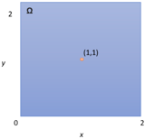
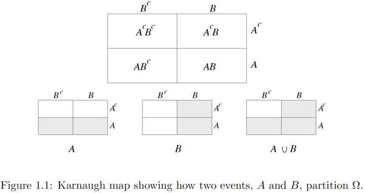
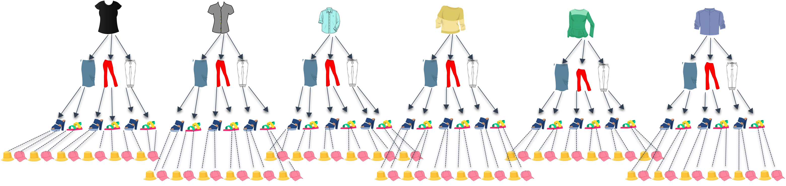
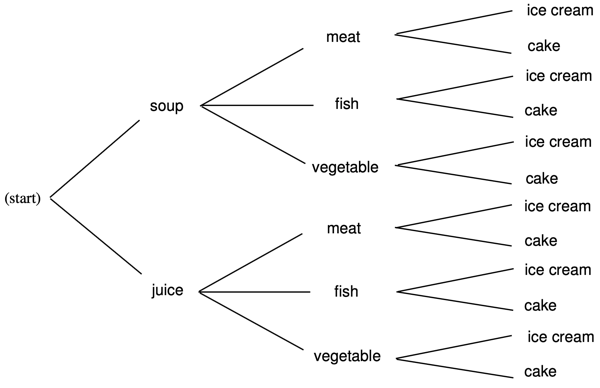
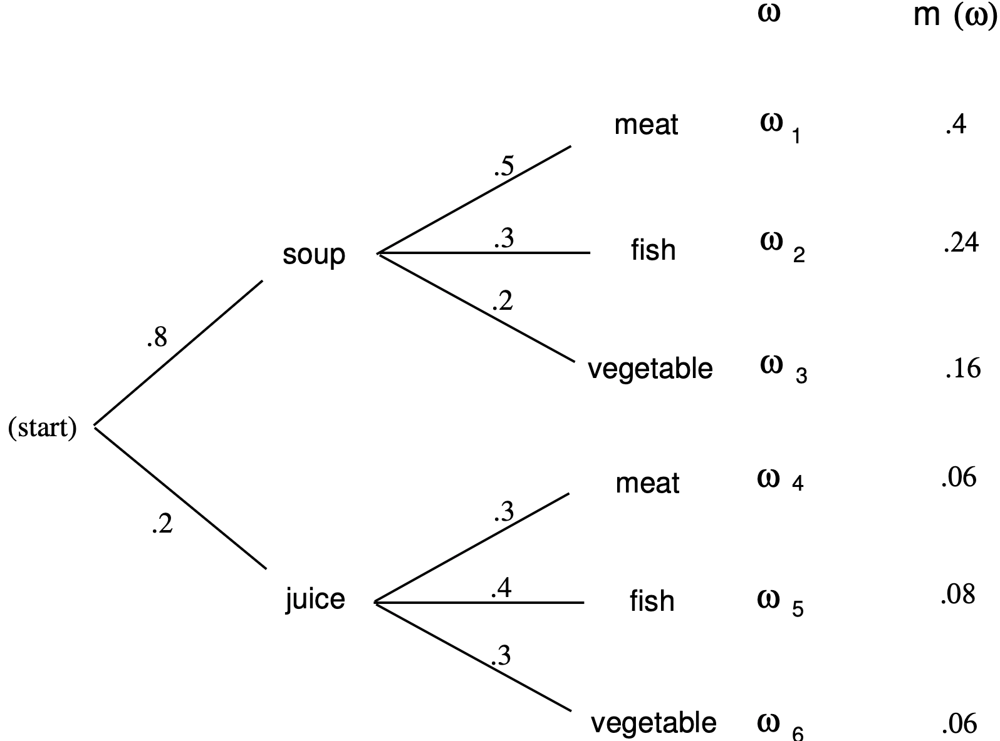
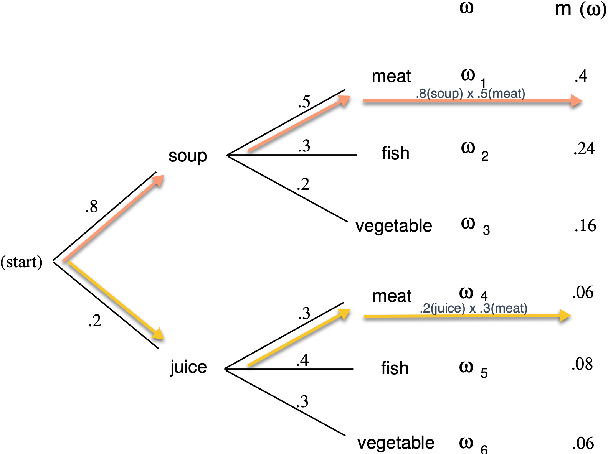

```{r setup, include=FALSE}
options(htmltools.dir.version = FALSE)
knitr::opts_chunk$set(
  fig.width=9, fig.height=3.5, fig.retina=3,
  out.width = "100%",
  cache = FALSE,
  echo = TRUE,
  message = FALSE, 
  warning = FALSE,
  hiline = TRUE
)
```

```{r xaringan-themer, include=FALSE, warning=FALSE}
library(xaringanthemer)
style_duo_accent(
  primary_color = "#07294D",
  secondary_color = "#FFC600",
  inverse_header_color = "#FFFFFF",
  link_color = "#006699"
)
```

## Objectives:

- Understand probability spaces
- Understand the principle of counting  
- Learn how to find permutations  
- Learn how to calculate combinations
- Know how to compute independent probability  
- Know how to compute conditional probability 
- Understand the different types of variables  
- Understand Bayes rule and how it can be useful 
- Understand what expectation is  
- Understand the importance of variance & standard variation  
- Know the main types of distributions  
- Understand the Central Limit Theorem  
- Know how to calculate a confidence interval  
- Know how to perform a hypothesis test
- Understand the significance of a p-value  

---
class: inverse center middle

## Probaility Spaces

---
## Probability Spaces

* Probability space = aka Probability triple $(\Omega, \mathcal{F}, \mathcal{P})$, a mathematical construct that provides a formal model of a random process that contains the *sample space*, *event space* and the *probability function*   
* Sample space $\Omega$ = A set of outcomes of an experiment - also can be referenced as *S*  
.center[**Example 1:** Toss a coin. *S* = {*H,T*}. |*S*| = 2]  
.center[**Example 2:** Toss *N* coins in succession.An outcome is the resulting sequence of *N* H's and T's.  
*S* = $\underbrace{(H,T) \times\cdots\times(H,T)}_{\mathrm{Ntimes}}$  
|*S*| = $2^N$]  
* Event = a subset of the sample space  
.center[**Example 3:** In the experiment where *N* = 4, there are 16 outcomes. The event 'there are at least two consecutive H's' is the set:  
*E = {HHHH, HHHT, HHTH, HHTT, THHH, THHT, TTHH}*]

---
## Probability Spaces (cont.)

* Discrete space = a *countable* set. Can be *finite* or *infinite*.  
.center[**Example 4:** Flip a coin repeatedly until you get heads. Outcome is the number of tosses:  
*S* = {1,2,3 $\dots$} = $Z^+$(set of positive integers)  
*S* is a *discrete infinite* sample space] 

* Continuous space = *infinite* number of items in the space  
.center[**Example 5:** Given we have a 2x2 sample space, what are the odds we throw a dart and it lands on (1,1)?  
  
There are an infinite number of spaces the dart could land on. The odds of it landing on *exactly* (1,1) is zero (see [Zeno's Paradox](https://blogs.unimelb.edu.au/sciencecommunication/2017/10/22/zenos-paradox-the-puzzle-that-keeps-on-giving/)). However, the continuous space for the dart hitting anywhere on the board is : $S = \{(x,y)\} \in R \times R: x \times y \le 2$]

---
## Probability Functions

* Probability function $\mathcal{P}$ = the set function that returns an event's probability, a real number between 0 and 1. Therefore $P: \mathcal{P}(S) \to [0,1]$ where $\mathcal{P}(S)$ is the *power set* of *S*; the set of all subsets of *S*.

* Probability Mass Function (PMF) = probability distribution; assigns a measure of likelihood, probability, of the outcome to each outcome in the sample space:
.center[ $P:S \rightarrow [0,1]$ where [0,1] denotes the *closed interval* $\{x \in R:0\le x \le 1\}$ *and* that $\sum\limits_{s \in S} P(s)=1$  
**Example 6:** For a coin toss, $P(0)=P(1)=\frac{1}{2}$. Likewise, for a fair die $P(i)=\frac{1}{6}$ for all $i \in \{1,2,3,4,5,6\}$. These are instances of *uniform distributions* on finite sample space, in which  
$P(s) = \frac{1}{|S|}$ for all $s \in S$]
* More specifically, $P$ can be extended from the PMF to:  
.center[ $P(E)=\sum\limits_{s \in S} P(s)$
]

* In the case where the PMF is *uniform*:
.center[This simplifies to: $P(E)=\frac{|E|}{|S|}$
]
---

## Probability Axioms 

* *De Morgan's Law* in the theory of sets is that the complement of the union of two sets is the intersection of the complements. Or vice versa: the complement of the intersection is the union of the complements:  
.center[
$(A \cup B)^c = A^cB^c$  
$(AB)^c=A^c\cup B^c$  
De Morgan's law is easy to verify using the *Karnaugh map* for two events:  


]
---

## Probability Axioms (cont.)

1. $P(E) \ge0$ for every event *E*  
2. $P(\Omega)=1$
3. Events are *mutually exclusive*, or *disjoint*, when the probability of them co-occurring is 0. Therefore, if $E_i \cap E_j = \emptyset$  whenever $i \neq j$
.center[
$P(E \cup F)=P(E)+P(F)$ - The sum can be finite or infinite. 
] 

If Axioms 1-3 are satisfied then $P$ has other intuitive properties (note, A, B, E used interchangeably):  
a. For any event $E, P(\overline{E})=1-P(E)$. That is because $E$ and $\overline{E}$ are mutually exclusive events and $\Omega=E \cap \overline{E}$. So Axioms 2 & 3 yield $P(E)+P(\overline{E}) = P(E \cap \overline{E}) = P(\Omega) =1$  
b. $P(\emptyset)=0.$ That is because $\emptyset$ and $\Omega$ are complements of each other, so by Property a and Axiom 2, $P(\emptyset)=1-P(\Omega)=0$   
c. If $A\subset B$ then $P(A) \le P(B)$. That is because $B=A \cup (A^cB)$ and $A$ & $A^cB$ are mutually exclusive, and $P(A^cB)\ge 0,$ so $P(A)\le P(A)+P(A^cB)=P(A\cup (A^cB))=P(B)$   
d. Events $E_1$ and $E_2$ in a sample space are *independent* if $E_2$ is no  more or less likely to occur when $E_1$ occurs than when $E_1$ does not occur: $P(E_1 \cap E_2)=P(E_1) \cdot P(E_2)$  
e. $P(A \cup B) = P(A) + P(B) - P(AB)$

---

## Probability Examples - Set of Dice
.pull-left[
**Example 1:** Let $S=\{1,2,3,4,5,6\} \times \{1,2,3,4,5,6\}$, with uniform distribution, representing the usual roll of 2 dice. Let $E_1$ be the event 'the first die is odd', and let $E_2$ be the event 'the second die is even'. Then:  
.center[
$E_1=\{1,3,5\}\times\{1,2,3,4,5,6\}$  
$E_2=\{1,2,3,4,5,6\}\times\{2,4,6\}$  
$E_1\cap E_2 = \{1,2,3\}\times \{4,5,6\}$  
So, $|E_1|=|E_2|=18, |E_1 \cap E_2| = 9$, thus:  
$P(E_1 \cap E_2)=9/36=1/4=1/2 \cdot 1/2 = P(E_1)\cdot P(E_2)$  
So, the events are *independent*
]
]
.pull-right[
```
# simulate N rolls of a pair of standard 
# dice and find the number of times 
# each roll occurs.

from pylab import *

def dice(N):
    d={} #Python dictionary
    for j in range(N):
        #need tuples to index dicts
        x=tuple(choice(arange(1,7),2)) 
        if x in d:
            d[x]+=1
        else:
            d[x]=1
    for j in arange(1,7):
        for k in arange(1,7):
            y=(j,k)
            print(y,':',d[y])
```
]
---
## Probability Examples - Beans

.pull-left[
**Example 2**: A jar contains 100 navy beans, 100 pinto, and 100 black beans. You reach in the jar and pull out 3 beans. What is the probability that the 3 beans are all different?  
- First define the sample space: $S=\{1,...,300\}\times \{1,...,300\}\times \{1,...300\}$  
This is equal to $300^3 = 2.7 \times 10^7$
- Event $|E|$ is all the triples (*i,j,k*) of beans with different colors. The first bean has 300 possible values, the second 200, and the third 100. Therefore $P$ with replacement:  
$|E|=300\times200\times100 =6 \times10^6$ 
$P(E)=|E|/S = 6/27 = 0.2222$
- Sampling *without* replacement changes the sample space:  
$S = 300 \times 299 \times 298$  
$P(E) = 6 \times 10^6 / (300 \times 299 \times 298) = 0.2245$
]
.pull-right[

```
# A bin contains b beans of each of 
# three colors (0,1,2).
# Pull out 3 beans (with or without 
# replacement). What is the probability
# that all three are different?

def bean_sim(b,numtrials,repl=True):
    # the jar
    beans=[0]*b+[1]*b+[2]*b 
    count=0
    for j in range(numtrials):
        sample=choice(beans,3,
          replace=repl)
        if (0 in sample) and 
          (1 in sample) and 
            (2 in sample):
            count+=1
    return count/numtrials

```
]
---
class: inverse center middle

## Counting

---
## Counting Principle

> Rule of Product: If you have one event, A, and another event, B, then there are A x B ways to perform both actions.

.center[*Events:* $a_1, a_2, \dots, a_n$  
*Total number of ways:* $a_1 \times a_2 \times \cdots a_n$]

- Example: I am packing for my vacation. I've selected 6 tops, 3 bottoms, 2 hats, and 2 pairs of shoes. How many different outfits can I make? 


--
.center[**= 72 different outfits**]
---
## Tree Diagrams

- A useful way to study the probabilities of events relating to experiments that take place in  stages and for which we are given the probabilities for the outcomes at each stage.

*Example:* Dining at a restaurant.How many possible choices do you have for a complete meal?  
</br>


---
## Representing Tree Diagram of Probabilities

Suppose the restaurant in the previous example wants to find the probability a customer chooses meat given they know the percentages of other choices?
--
.pull-left[

| Symbol      | Meaning                                   |
|:------------|:------------------------------------------|
| $\Omega$    | The sample space - the set of all possible outcomes|
| $\omega$    | An outcome. A sample point in the sample space |
| $\omega_j$  | Finite number of outcomes in the sample space |
| $m(\omega_j)$| The *distribution function*. Each outcome $\omega_j$ is a assigned a nonnegative number $m(\omega_j)$ in such a way that $m(\omega_1)+m(\omega_2)+\cdots + m(\omega_j) = 1$ |
]

--

.pull-right[
]

---
## Representing Tree Diagram of Probabilities

Suppose the restaurant in the previous example wants to find the probability a customer chooses meat given they know the percentages of other choices?

.pull-left[
| Symbol      | Meaning                                   |
|:------------|:------------------------------------------|
| $\Omega$    | The sample space - the set of all possible outcomes|
| $\omega$    | An outcome. A sample point in the sample space |
| $\omega_j$  | Finite number of outcomes in the sample space |
| $m(\omega_j)$| The *distribution function*. Each outcome $\omega_j$ is a assigned a nonnegative number $m(\omega_j)$ in such a way that $m(\omega_1)+m(\omega_2)+\cdots + m(\omega_j) = 1$ |

]

.pull-right[
]
--

#### The probability a customer chooses meat is $m(\omega_1)+m(\omega_4)=.46$
---
## Permutations

> How many sequences of *k* elements of *{1,...,n}* have all *k* elements distinct?

For example, with $n=5,k=3$, then (4,5,1) is such a sequence, but (1,5,1) is not. We have *n* choices for the first component of the sequence, and for each such choice, $n-1$ choices for the second, etc. So, by the above principle, the number of such sequences is:  
.center[
$n \cdot (n-1) \cdots (n-k+1) = \frac{n!}{(n-k)!}$
]  

This is the number of *k-permutations* of an n-element set. If $n = k$, then $(n-k)!=0!=1$, so the number of n-permutations of $\{1,...,n\} = n!$. In this case, we just call them *permutations* of $\{1,...,n\}$. If $n < k$, then the formula does not make sense - there are no *k-permutations* of $\{1,...,n\}$.

**Example.** What is the number of sequences of 2 distinct cards drawn from a deck of cards (sampling without replacement)? 
.center[
$52 \times 51 = \frac{52!}{50!}$
]
---
## A Birthday Example

.pull-left[
*Problem:* How many people do we need to have in a room to make a favorable bet, *p(success) > 0.5*, that two people in the room will have the same birthday(no duplication of birthdays)?  
* 365 = possible birthdays for each person(ignore leap year) 
* *r* = number of people in a room

To solve this, let's order the people from 1 to *r*. For this example, let's say we have 25 people, therefore a sequence of 25 birthdays. The number of possible birthdays for the first person is 365. What about for the second person?  
* For each possible birthday in the sequence of person #1, there are 365 x 365 for #2 = $365^2$  
* Person #3 = $365^3$  
* $365^r$ possible sequences of birthdays.
]
.pull-right[
Given we must find the number of these sequences that have no duplication, for example person #1 could have any of 365 days, then any of remaining 364 for person #2, until we make *r* choices, there will be $365-r+1$ possibilities. The total number of sequences with no duplication is: $365 \cdot 364 \cdot 363 \cdot ... \cdot (365-r+1)$  
Assuming each sequence is likely:  
$p_r = \frac{365 \cdot 364 \cdot 363 \cdot ... \cdot(365-r+1)} {365^r}$

Let's see the top 20-25 people
```
f
```
]
---
## Permutations

> The numbers of ways that a particular event can occur


---
## Combinations

---
class: inverse center middle

## Probability

---
class: inverse center middle

## Statistical Foundations


---

## Variables

---

## Expectation

> This is a blockquote following a header.
>
> When something is important enough, you do it even if the odds are not in your favor.

---

## Variance

#### R Code

```{r eval=FALSE}
ggplot(gapminder) +
  aes(x = gdpPercap, y = lifeExp, size = pop, color = country) +
  geom_point() +
  facet_wrap(~year)
```

---

## Standard Deviation

```{r eval=FALSE}
dplyr::starwars %>% dplyr::slice_sample(n = 4)
```

---

## Distributions

```{r message=TRUE, eval=requireNamespace("cli", quietly = TRUE)}
cli::cli_alert_success("It worked!")
```

```{r message=TRUE}
message("Just a friendly message")
```

```{r warning=TRUE}
warning("This could be bad...")
```


```{r error=TRUE}
stop("I hope you're sitting down for this")
```


---

## Central Limit Theorem

---
exclude: `r if (requireNamespace("tibble", quietly=TRUE)) "false" else "true"`

```{r eval=requireNamespace("tibble", quietly=TRUE)}
tibble::as_tibble(mtcars)
```

---

## Confidence Intervals

```{r}
knitr::kable(head(mtcars), format = 'html')
```

---

## Hypothesis Testing

```{r eval=requireNamespace("DT", quietly=TRUE)}
DT::datatable(head(mtcars), fillContainer = FALSE, options = list(pageLength = 4))
```

---

## Resources

* Grinstead, C. M. & Snell, J. L. (1997). Introduction to probability. Providence, RI: American Mathematical Society. Book can be downloaded at: https://chance.dartmouth.edu/teaching_aids/books_articles/probability_book/book.html 