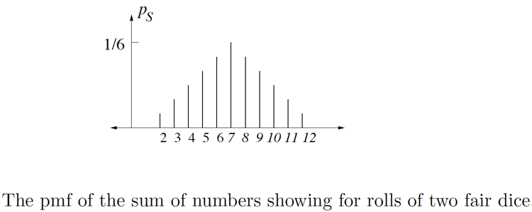
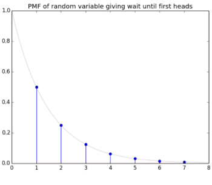

```{r setup, include=FALSE}
options(htmltools.dir.version = FALSE)
knitr::opts_chunk$set(
  fig.width=9, fig.height=3.5, fig.retina=3,
  out.width = "100%",
  cache = FALSE,
  echo = TRUE,
  message = FALSE, 
  warning = FALSE,
  hiline = TRUE
)
```

```{r xaringan-themer, include=FALSE, warning=FALSE}
library(xaringanthemer)
style_duo_accent(
  primary_color = "#07294D",
  secondary_color = "#FFC600",
  inverse_header_color = "#FFFFFF",
  link_color = "#006699"
)
```

## Objectives:

- Understand probability spaces
- Understand the principle of counting  
- Learn how to find permutations  
- Learn how to calculate combinations
- Know how to compute independent probability  
- Know how to compute conditional probability 
- Understand the different types of variables  
- Understand Bayes rule and how it can be useful 
- Understand what expectation is  
- Understand the importance of variance & standard variation  
- Know the main types of distributions  
- Understand the Central Limit Theorem  
- Know how to calculate a confidence interval  
- Know how to perform a hypothesis test
- Understand the significance of a p-value  

---
class: inverse center middle

## Probaility

---
## Probability Spaces

* Probability space = aka Probability triple $(\Omega, \mathcal{F}, \mathcal{P})$, a mathematical construct that provides a formal model of a random process that contains the *sample space*, *event space* and the *probability function*   
* Sample space $\Omega$ = A set of outcomes of an experiment - also can be referenced as *S*  
.center[**Example 1:** Toss a coin. *S* = {*H,T*}. |*S*| = 2]  
.center[**Example 2:** Toss *N* coins in succession.An outcome is the resulting sequence of *N* H's and T's.  
*S* = $\underbrace{(H,T) \times\cdots\times(H,T)}_{\mathrm{Ntimes}}$  
|*S*| = $2^N$]  
* Event = a subset of the sample space  
.center[**Example 3:** In the experiment where *N* = 4, there are 16 outcomes. The event 'there are at least two consecutive H's' is the set:  
*E = {HHHH, HHHT, HHTH, HHTT, THHH, THHT, TTHH}*]

---
## Probability Spaces (cont.)

* Discrete space = a *countable* set. Can be *finite* or *infinite*.  
.center[**Example 4:** Flip a coin repeatedly until you get heads. Outcome is the number of tosses:  
*S* = {1,2,3 $\dots$} = $Z^+$(set of positive integers)  
*S* is a *discrete infinite* sample space] 

* Continuous space = *infinite* number of items in the space  
.center[**Example 5:** Given we have a 2x2 sample space, what are the odds we throw a dart and it lands on (1,1)?  
  
There are an infinite number of spaces the dart could land on. The odds of it landing on *exactly* (1,1) is zero (see [Zeno's Paradox](https://blogs.unimelb.edu.au/sciencecommunication/2017/10/22/zenos-paradox-the-puzzle-that-keeps-on-giving/)). However, the continuous space for the dart hitting anywhere on the board is : $S = \{(x,y)\} \in R \times R: x \times y \le 2$]

---
## Probability Functions

* Probability function $\mathcal{P}$ = the set function that returns an event's probability, a real number between 0 and 1. Therefore $P: \mathcal{P}(S) \to [0,1]$ where $\mathcal{P}(S)$ is the *power set* of *S*; the set of all subsets of *S*.

* Probability Mass Function (PMF) = probability distribution; assigns a measure of likelihood, probability, of the outcome to each outcome in the sample space:
.center[ $P:S \rightarrow [0,1]$ where [0,1] denotes the *closed interval* $\{x \in R:0\le x \le 1\}$ *and* that $\sum\limits_{s \in S} P(s)=1$  
**Example 6:** For a coin toss, $P(0)=P(1)=\frac{1}{2}$. Likewise, for a fair die $P(i)=\frac{1}{6}$ for all $i \in \{1,2,3,4,5,6\}$. These are instances of *uniform distributions* on finite sample space, in which  
$P(s) = \frac{1}{|S|}$ for all $s \in S$]
* More specifically, $P$ can be extended from the PMF to:  
.center[ $P(E)=\sum\limits_{s \in S} P(s)$
]

* In the case where the PMF is *uniform*:
.center[This simplifies to: $P(E)=\frac{|E|}{|S|}$
]
---

## Probability Axioms 

* *De Morgan's Law* in the theory of sets is that the complement of the union of two sets is the intersection of the complements. Or vice versa: the complement of the intersection is the union of the complements:  
.center[
$(A \cup B)^c = A^cB^c$  
$(AB)^c=A^c\cup B^c$  
De Morgan's law is easy to verify using the *Karnaugh map* for two events:  


]
---

## Probability Axioms (cont.)

1. $P(E) \ge0$ for every event *E*  
2. $P(\Omega)=1$
3. Events are *mutually exclusive*, or *disjoint*, when the probability of them co-occurring is 0. Therefore, if $E_i \cap E_j = \emptyset$  whenever $i \neq j$
.center[
$P(E \cup F)=P(E)+P(F)$ - The sum can be finite or infinite. 
] 

If Axioms 1-3 are satisfied then $P$ has other intuitive properties (note, A, B, E used interchangeably):  
a. For any event $E, P(\bar{E})=1-P(E)$. That is because $E$ and $\bar{E}$ are mutually exclusive events and $\Omega=E \cap \bar{E}$. So Axioms 2 & 3 yield $P(E)+P(\bar{E}) = P(E \cap \bar{E}) = P(\Omega) =1$  
b. $P(\emptyset)=0.$ That is because $\emptyset$ and $\Omega$ are complements of each other, so by Property a and Axiom 2, $P(\emptyset)=1-P(\Omega)=0$   
c. If $A\subset B$ then $P(A) \le P(B)$. That is because $B=A \cup (A^cB)$ and $A$ & $A^cB$ are mutually exclusive, and $P(A^cB)\ge 0,$ so $P(A)\le P(A)+P(A^cB)=P(A\cup (A^cB))=P(B)$   
d. Events $E_1$ and $E_2$ in a sample space are *independent* if $E_2$ is no  more or less likely to occur when $E_1$ occurs than when $E_1$ does not occur: $P(E_1 \cap E_2)=P(E_1) \cdot P(E_2)$  
e. $P(A \cup B) = P(A) + P(B) - P(AB)$

---

## Probability Examples - Set of Dice
.pull-left[
**Example 1:** Let $S=\{1,2,3,4,5,6\} \times \{1,2,3,4,5,6\}$, with uniform distribution, representing the usual roll of 2 dice. Let $E_1$ be the event 'the first die is odd', and let $E_2$ be the event 'the second die is even'. Then:  
.center[
$E_1=\{1,3,5\}\times\{1,2,3,4,5,6\}$  
$E_2=\{1,2,3,4,5,6\}\times\{2,4,6\}$  
$E_1\cap E_2 = \{1,2,3\}\times \{4,5,6\}$  
So, $|E_1|=|E_2|=18, |E_1 \cap E_2| = 9$, thus:  
$P(E_1 \cap E_2)=9/36=1/4=1/2 \cdot 1/2 = P(E_1)\cdot P(E_2)$  
So, the events are *independent*
]
]
.pull-right[
```
# simulate N rolls of a pair of standard 
# dice and find the number of times 
# each roll occurs.

from pylab import *

def dice(N):
    d={} #Python dictionary
    for j in range(N):
        #need tuples to index dicts
        x=tuple(choice(arange(1,7),2)) 
        if x in d:
            d[x]+=1
        else:
            d[x]=1
    for j in arange(1,7):
        for k in arange(1,7):
            y=(j,k)
            print(y,':',d[y])
```
]
---
## Probability Examples - Beans

.pull-left[
**Example 2**: A jar contains 100 navy beans, 100 pinto, and 100 black beans. You reach in the jar and pull out 3 beans. What is the probability that the 3 beans are all different?  
- First define the sample space: $S=\{1,...,300\}\times \{1,...,300\}\times \{1,...300\}$  
This is equal to $300^3 = 2.7 \times 10^7$
- Event $|E|$ is all the triples (*i,j,k*) of beans with different colors. The first bean has 300 possible values, the second 200, and the third 100. Therefore $P$ with replacement:  
$|E|=300\times200\times100 =6 \times10^6$ 
$P(E)=|E|/S = 6/27 = 0.2222$
- Sampling *without* replacement changes the sample space:  
$S = 300 \times 299 \times 298$  
$P(E) = 6 \times 10^6 / (300 \times 299 \times 298) = 0.2245$
]
.pull-right[

```
# A bin contains b beans of each of 
# three colors (0,1,2).
# Pull out 3 beans (with or without 
# replacement). What is the probability
# that all three are different?

def bean_sim(b,numtrials,repl=True):
    # the jar
    beans=[0]*b+[1]*b+[2]*b 
    count=0
    for j in range(numtrials):
        sample=choice(beans,3,
          replace=repl)
        if (0 in sample) and 
          (1 in sample) and 
            (2 in sample):
            count+=1
    return count/numtrials

```
]
---
class: inverse center middle

## Counting

---
## Counting Principle

> Rule of Product: If you have one event, A, and another event, B, then there are A x B ways to perform both actions.

.center[*Events:* $a_1, a_2, \dots, a_n$  
*Total number of ways:* $a_1 \times a_2 \times \cdots a_n$]

- Example: I am packing for my vacation. I've selected 6 tops, 3 bottoms, 2 hats, and 2 pairs of shoes. How many different outfits can I make? 


--
.center[**= 72 different outfits**]
---
## Tree Diagrams

- A useful way to study the probabilities of events relating to experiments that take place in  stages and for which we are given the probabilities for the outcomes at each stage.

*Example:* Dining at a restaurant.How many possible choices do you have for a complete meal?  
</br>


---
## Representing Tree Diagram of Probabilities

Suppose the restaurant in the previous example wants to find the probability a customer chooses meat given they know the percentages of other choices?
--
.pull-left[

| Symbol      | Meaning                                   |
|:------------|:------------------------------------------|
| $\Omega$    | The sample space - the set of all possible outcomes|
| $\omega$    | An outcome. A sample point in the sample space |
| $\omega_j$  | Finite number of outcomes in the sample space |
| $m(\omega_j)$| The *distribution function*. Each outcome $\omega_j$ is a assigned a nonnegative number $m(\omega_j)$ in such a way that $m(\omega_1)+m(\omega_2)+\cdots + m(\omega_j) = 1$ |
]

--

.pull-right[
]

---
## Representing Tree Diagram of Probabilities

Suppose the restaurant in the previous example wants to find the probability a customer chooses meat given they know the percentages of other choices?

.pull-left[
| Symbol      | Meaning                                   |
|:------------|:------------------------------------------|
| $\Omega$    | The sample space - the set of all possible outcomes|
| $\omega$    | An outcome. A sample point in the sample space |
| $\omega_j$  | Finite number of outcomes in the sample space |
| $m(\omega_j)$| The *distribution function*. Each outcome $\omega_j$ is a assigned a nonnegative number $m(\omega_j)$ in such a way that $m(\omega_1)+m(\omega_2)+\cdots + m(\omega_j) = 1$ |

]

.pull-right[
]
--

#### The probability a customer chooses meat is $m(\omega_1)+m(\omega_4)=.46$
---
## Permutations

> How many sequences of *k* elements of *{1,...,n}* have all *k* elements distinct?

For example, with $n=5,k=3$, then (4,5,1) is such a sequence, but (1,5,1) is not. We have *n* choices for the first component of the sequence, and for each such choice, $n-1$ choices for the second, etc. So, by the above principle, the number of such sequences is:  
.center[
$n \cdot (n-1) \cdots (n-k+1) = \frac{n!}{(n-k)!}$
]  

This is the number of *k-permutations* of an n-element set. If $n = k$, then $(n-k)!=0!=1$, so the number of n-permutations of $\{1,...,n\} = n!$. In this case, we just call them *permutations* of $\{1,...,n\}$. If $n < k$, then the formula does not make sense - there are no *k-permutations* of $\{1,...,n\}$.

**Example.** What is the number of sequences of 2 distinct cards drawn from a deck of cards (sampling without replacement)? 
.center[
$52 \times 51 = \frac{52!}{50!}$
]
---
## A Birthday Example

.pull-left[
*Problem:* Given there are 30 people in a room, what is the probability that there are 2 people with the same birthday?  
* 365 = possible birthdays for each person(ignore leap year) 
* *k* = number of people in a room

To solve this, let's order the people from 1 to *k*. First, let's find the probability that all 30 people have different birthdays. The number of possible birthdays for the first person is 365. What about for the second person?  
* For each possible birthday in the sequence, there is one less available date so, for #2 = 364
* Person #3 = 363, etc.
* What is the sample space? 
$|S| = 365^30, |E| = 365 \times \cdots 336$
]
.pull-right[
Therefore, the probability that all 30 people have different birthdays is 

.center[
$P(E) = \frac{|E|}{|S|}= \frac{365}{365}\cdot \frac{364}{365}\cdots \frac{336}{365} = \frac{365 \cdot 364 \cdots (365-k+1)}{365^k}$
]

Then, the probability that there are two people with the same birthday is just the probability of the *complementary* event,

.center[
$1 -P(E) \approx 0.71$
]

This problem can also be solved the an *exponential approximation*...
]
---
## Exponential Approximation

> The tangent line to the equation $y=e^x$ at $x=0$ is $y=1+x$. For small values of $x$, positive or negative, $1+x$ is a good approximation to $e^x$, and vice-versa

</br>
.center[]


---

## Exponential Approximation - Birthday Edition

Previously, we saw that the probability of no two people out of *k* having the same birthday as: $\frac{365 \cdot 364 \cdots (365-k+1)}{365^k}$

This can be rewritten using exponential approximation:  
.center[
$(1-\frac{1}{365}) \cdot (1-\frac{2}{365}) \cdots (1-\frac{k-1}{365})$  
$< e^\frac{-1}{365} \cdots e^{-(k-1)/365}$  
$= e^{-(1+2+\cdots+(k-1))/365}$  
$= e^{-k(k-1)/(2\cdot 365)}$  
$< e^{-(k-1)^2 / 730}$
]

Note, that as the value of *k* gets larger, the probability gets smaller. Let's say we want to find at what point it falls below 0.1, meaning the probability that at least 2 people having the same birthday is 90%. To do this we can solve:

.center[
$e^{-(k-1)^2 / 730} = 0.1$  
Take reciprocals: $e^{(k-1)^2 / 730} = 10$  
Take natural log: $\frac{(k-1)^2}{730}=ln 10$  
Thus, $k=1+\sqrt{730 \cdot ln10} \approx 41$ people
]
---

## Birthday Edition - the Code:

.pull-left[
```
#birthday plots

from pylab import *

def exact():
    vals=[1]
    prod =1
    #No need to go higher than 70 people
    for k in range(1,71):  
        prod *= (365-k)/365
        vals=concatenate((vals,[prod]))
    plot(arange(1,72),1-vals,label='exact')
    xlabel("Number of people.")
```
]
.pull-right[
```
# compute and plot the same thing with 
# the exponential approximation
def approximate():
  vals=array([1])
  prod =1
  for k in range(1,71):  
      prod *= exp(-k/365)
      vals=concatenate((vals,[prod]))
  plot(arange(1,72),1-vals,
    label='1-exp(-k(k-1)/(2X365))')
  xlabel("Number of people.")

def do_both():
    exact()
    title("Probability of 
      coincidental birhday (exact).")
    show()
    approximate()
    title("Proability of 
    coincidental birthday (approximate).")
    show()

```
]

---
## Binomial Coefficients

> The number of k-element subsets of an n-element set (when $0 \le k \le n$), "n choose k";  
.center[
$\binom{n}{k}=\frac{n!}{(n-k)!k!}$ ]

This formula works when n=0 or when k=0, k=n because 0! = 1.

*Properties:*  
* $\binom{n}{0}=\binom{n}{n}$ for all $n \ge 0$  
* $\binom{n}{k}=\binom{n}{n-k}$ for all $0 \le k \le n$  
* $\binom{n}{k}=\binom{n-1}{k-1}+\binom{n-1}{k}$ for all $1 \le k \le n$ 

**Example.** Select 5 cards from a 52-card deck. What is the probability of getting a flush (all cards of the same suit)?

* Given that the probability distribution is uniform, the probability of any event *E* is given by: $\frac{|E|}{\binom{52}{5}}$  
* For the flush, each suit has 13 cards, so that there are $\binom{13}{5}$ flushes in that suit, thus:
.center[
$|E| = 4 \cdot \binom{13}{5}$
]
---

## Binomial Theorem

**Problem.** $(x+y)^4 = xxxx+xxxy+xxyx+\cdots+yyyx+yyyy$

The right-hand is the sum of all sequences of 4 x's and y's. The coefficient of $x^{4-k} y^k$ is the number of such sequences containing exactly $k$ $y$'s Thus:  
.center[
$(x+y)^4 = \binom{4}{0}x^4 + \binom{4}{1}x^3y + \binom{4}{2}x^2y^2 + \binom{4}{3}xy^3 + \binom{4}{4}y^4$  
$= x^4 +4x^3y +6x^2y^2+4xy^3+y^4$  
Therefore, for any $n \ge 0$  
$(x+y)^n = \sum\limits_{k=0}^n \binom{n}{k}x^k y^{n-k}$
]

**Example.** How many ways are there to arrange the letters of the word MISSISSIPPI?  
- There are 11 letters and if all were different the answer would be 11!. But, in this problem, many of those 11! arrangements represent the same string so we need to treat the problem as a sequence of choices for each of the distinct letters. 4/11 positions to hold I, then for each choice 4/7 remaining positions to hold S, then 2/3 remaining positions to hold P. After that there is only 1 position remaining for M:  
.center[
$\binom{11}{4} \binom{7}{4} \binom{3}{2} = \frac{11!}{4!7!} \cdot \frac{7!}{4!3!} \cdot \frac{3!}{2!1!} = \frac{11!}{4!4!2!}$
]
---
class: inverse center middle

## Discrete Random Variables, PMFs & CDFs


---

## Discrete-type Random Variables

> *Random variable X* assigns a number to the outcome of an experiment.

**Example.** Coin Tosses - toss a fair coin 20 times:
- $X_1$ = the number of heads tossed
- $X_2$ = excess heads over tails (number of heads - number of tails)
- $X_3$ = length of the longest run of consecutive heads or tails
- $X_4$ = number of tosses until heads comes up

These are all *random variables*.

A random variable is said to be *discrete-type* if there is a finite set $u_1,...,u_n$ or a countable infinite set $u_1,u_2,...$ such that 

.center[
$P\{X \in \{u_1,u_2,...\}\} = 1$
]

The *probability mass function* (pmf) for a discrete-type random variable $X, p_X$, is defined by $p_X(u)=P\{X=u\}$ The above formula can be written as
.center[
$\sum\limits_{i}p_X(u_i) = 1$
]
---

## Discrete Random Variables- Examples

**Example.** Let *S* be the sum of the numbers showing on a pair of fair dice when they are rolled. Find the pmf of *S*.

**Solution:** The underlying sample space is $\Omega = \{(i,j):1\le i \le 6, 1 \le j \le 6\}$, and it has 36 possible outcomes, each having a probability of $1/36$. The smallest value of *S* is 2 thus $\{S=2\}=\{(1,1)\}$. That is, there is only one outcome resulting in *S* = 2, so $p_S(2)=1/36$. Similarly, $\{S=3\}=\{(1,2),(2,1)\}$, so $p_S(3)=2/36$. And, $\{S=4\}=\{(1,3),(2,2),(3,1)\}$, so $p_S(4)=3/36$ and so forth. The pmf of *S* is shown below.  
</br>

.center[]

---

## Independent Random Variables

> Two random variables are said to be *independent* if for all $a,b \in \mathbf{R}$,  

.center[
$\{s \in S: X_1(s)=a\}, \{s \in S:X_2(s) =b\}$
]

are independent event. Recall this means that for all *a* and *b*,
.center[
$P((X_1=a) \land (X_2=b)) = P(X_1=a) \cdot P(X_2=b).$
]

This implies that for any *sets* *A* and *B* of values, 
.center[
$\{s \in S: X_1(s) \in A\},\{s \in S:X_2(s) \in B\}$
]

are also independent events. 

.footnote[
The symbol $\land$ can be read as "and".
]
---

## Independent Random Variables - Example

We naturally assume that the random variables that we denoted in the previous dice example, representing the individual outcomes of each of the two dice ( $Y_{2,1}$ and $Y_{2,2}$ ), are independent. We can compute the PMF of the sum $Y_2=Y_{2,1} + Y_{2,2}$. For example, the event $Y_2=8$ is the disjoint union of the events: 

.center[
$(Y_{2,1}=2) \land (Y_{2,1}=6)$  
$(Y_{2,1}=3) \land (Y_{2,1}=5)$  
$(Y_{2,1}=4) \land (Y_{2,1}=4)$  
$(Y_{2,1}=5) \land (Y_{2,1}=3)$  
$(Y_{2,1}=6) \land (Y_{2,1}=2)$
]

Independence implies that each of these events has probability $\frac{1}{6} \cdot \frac{1}{6} = \frac{1}{36}$, so $P_{Y_2}(8)= \frac{5}{36}$

> If we know the distributions of two random variables, and we know that they are independent, then we can compute the distribution of their sum (and, likewise, their product, or any other operation performed on them).  

Note: $Y_2$ and $Y_{2,2}$ are *not* independent. The sum of the two dice really does depend on what shows up on the second die! We can verify this formally: $P(Y_2=12)=\frac{1}{36}$. $P(Y_{2,2}=5)=\frac{1}{6}$, BUT $P((Y_2=12)\land(Y_{2,2}=5))=0\neq 1/36 \cdot 1/6$

---

## Cumulative Distribution Function (CDF)

> The *cumulative distribution* function of a random variable $X$, denote $F_X$, is a function  
.center[
$F_X:\mathbf{R} \rightarrow [0,1]$  
]
defined by:  
.center[
$F_X(a) = P(X \le a)$.
]

For discrete random variables, we can compute the CDF as: $F_X(a)=\sum\limits_{b\le a}P_X(b)$  
For discrete random variables, the CDF is a step function as shown below for the sum of two dice.  

.center[]

---
## Simulating the roll of 2 dice - code

.pull-left[
```
# Compute probabilites for the roll of 2
# dice. The value returned is an array of
# the cardinality of the frequencies of
# the events X=i for i from 2 through 12.

from pylab import *

def dice_frequencies():
    #generate the sample space
    s=[(i,j) for i in range(1,7) 
      for j in range(1,7)]
    t=[sum(pair) for pair in s]
    h=histogram(t,bins=arange(1.5,13,1))
    return h[0]
```
]

.pull-right[
```
# Use the cumulative distribution
# function to simulate 100,000 samples 
# from this distribution.  Then obtain a
# histogram of the relative frequencies
# and plot them side by side with the
# theoretically derived probabilities.
def display():
    y=dice_frequencies()/36
    z=cumsum(y)
    stem(arange(2,13),y,label='computed',
      linefmt='r-',markerfmt='k.')
    samples=[2+searchsorted(z,random()) 
      for j in range(100000)]
    h=histogram(samples,
      bins=arange(1.5,13,1))
    stem(arange(2.2,13.2,1),h[0]/100000,
      label='simulated',linefmt='k-',
        markerfmt='r.')
    title('PMF of sum of two dice')
    legend(loc='upper right')
    show()
```

]
---
class: inverse center middle
## Important Discrete Random Variables


---

## Bernoulli Distribution

> A random variable $X$ is said to have the *Bernoulli distribution* with parameter $p$, where $0 \le p \le1$, if $P(X = 1) = p$ and $P(X = 0) = 1-p$

Note: There is not one Bernoulli distribution - you get a different PMF for every value of a parameter $p$.

**Example.** Flip a biased coin with heads probability $P$, and set $X=1$ if the results is heads and $X=0$ otherwise. 

#### Bernoulli Trials

The principal use of the binomial coefficients will occur in the study of one of the important chance processes called *Bernoulli trials*. Bernoulli trials process is a sequence of $n$ chance experiments such that: 
.pull-left[
1. Each experiment has two possible outcomes, which we may call success and failure  
2. The probability $p$ of success on each experiment is the same for each experiment, and this probability is not affected by any knowledge of previous outcomes. The probability $p$ of failure is given by $q = 1 − p$.
]
.pull-right[
.center[]
]
---

## Binomial Distribution

> Suppose $n$ independent Bernoulli trials are conducted, each resulting in a 1 with probability $p$ and a 0 with probability $1-p$. Let X denote the total number of 1s occurring in the $n$ trials. Any particular outcome with $k$ ones and $n-k$ zeros has the probability $p^k(1-p)^{n-k}$. Since there are $\binom{n}{k}$ possible outcomes, we find the pmf of $X$ is
.center[
$P_X(k)=\binom{n}{k}p^k(1-p)^{n-k}$
]

**Example.** The number of heads on $n$ successive tosses of a biased coin with heads probability $p$.

The distribution of $X$ is called the *binomial distribution* with parameters $n$ and $p$

.center[]
---

## Geometric Distribution

> There is a single parameter $0 \le p \le 1$. If $k$ is a positive integer, then  
.center[
$P_X(k)=(1-p)^{k-1}p$
]

**Example.** $X$ is the number of flips of a biased coin with heads probability $p$ until heads appears. For instance, $X=1$ if the first toss is heads, $X=3$ if the first two are tails and the third is heads. Note that this has a nonzero value at all posisive integers $k$.

.center[

]
---

## Poisson Distribution

> Let $\lambda > 0$. We set 
.center[
$P(X=k)= \frac{\lambda^k}{k!} \cdot e^{-\lambda}$ for $k \ge 0$
]

By this definition, the first 4 terms of this PMF are: $p(0)=e^{-\lambda}$, $p(1)=\lambda e^{-\lambda}$, $p(2)=\frac{\lambda^2}{2} e^{-\lambda}$, $p(3)=\frac{\lambda^3}{6} e^{-\lambda}$.  
The Poisson distribution arises frequently in practice, because it is a good approximation for a binomial distribution with parameters $n$ and $p$, when n is very large, $p$ is very small, and $\lambda = np$. Some examples in which such binomial distributions occur are:  
* Incoming phone calls in a fixed time interval: $n$ is the number of people with cell phones within the access region of one base station, and $p$ is the probability that a given such person will make a call within the next minute.  
* Misspelled words in a document: $n$ is the number of words in a document and $p$ is the probability that a given word is misspelled.

**Example.** Suppose 500 shots are fired at a target. It is known that only about one in one hundred shots hit the bulls-eye. What is the probability of getting 3 or more bulls-eyes? To solve this, we compute the complementary (0,1,or 2), In the Poisson approximation this is given by: $e^{-\lambda}(1+\lambda+\lambda^2/2) = 18.5e^{-5} \approx0.125$. There for the probability of at least 3 bulls-eyes is about 0.875
---

## Expected value of a random variable

> $E(X)$ denotes the *expected value*, or *expectation*, or *mean* of the random variable X. The definition is just the weighted average of the values of X, where the weights are the probabilities:  
.center[
$E(X)=\sum\limits_{a} a \cdot P_X(a)$
]

####Simple Examples

.pull-left[

1. A single die: Here, $P_X(i) = 1/6$ for $i=1,...,6$.
So, 
$E(X) = \sum\limits_{i=1}^6 i \cdot \frac{1}{6} = \frac{1}{6} \sum\limits_{i=1}^6 i=\frac{1}{6} \cdot 21 = 3.5$   

2. Sum of two dice: Looking at the PMF of the sum of two dice, it is apparent that $E(X)=7$. For an $i$ between 0 and 5, $P(X=7-i)=P(X=7+i)$. In other words, 2 has the same probability as 12, 3 as 11, etc. So,
]

.pull-right[.center[]]

---

## Linearity of Expectation

The prior example demonstrated why the symmetry in the graph makes the value 7, without having to use any calculated values for the probability. There is a simpler way to calculate the expectation of the two dice based on linearity of expectation.   
If $X,Y$ are random variables defined on the sample space, then:  
.pull-left[


In a like manner, if $X_!,...,X_n$ are all defined on $S$ then $E(X_1+...+X_n)=E(X_1)_...+E(X_n)$
]

.pull-right[
So if we were to redo the previous example with 2 dice:  

$E(X) = E(X_1 + X_2)$  
$=E(X_1)+E(X_2)$  
$= 3.5 +3.5 = 7$  

Additionally, if $c \in \mathbf{R}$ is constant, then   
$E(cX) = c \cdot E(X)$

]
---
class: inverse center middle

## Continuous Random Variables, PMFs & CDFs


---
## Expectation

> This is a blockquote following a header.
>
> When something is important enough, you do it even if the odds are not in your favor.

---

## Variance

#### R Code

```{r eval=FALSE}
ggplot(gapminder) +
  aes(x = gdpPercap, y = lifeExp, size = pop, color = country) +
  geom_point() +
  facet_wrap(~year)
```

---

## Standard Deviation

```{r eval=FALSE}
dplyr::starwars %>% dplyr::slice_sample(n = 4)
```

---

## Distributions

```{r message=TRUE, eval=requireNamespace("cli", quietly = TRUE)}
cli::cli_alert_success("It worked!")
```

```{r message=TRUE}
message("Just a friendly message")
```

```{r warning=TRUE}
warning("This could be bad...")
```


```{r error=TRUE}
stop("I hope you're sitting down for this")
```


---

## Central Limit Theorem

---
exclude: `r if (requireNamespace("tibble", quietly=TRUE)) "false" else "true"`

```{r eval=requireNamespace("tibble", quietly=TRUE)}
tibble::as_tibble(mtcars)
```

---

## Confidence Intervals

```{r}
knitr::kable(head(mtcars), format = 'html')
```

---

## Hypothesis Testing

```{r eval=requireNamespace("DT", quietly=TRUE)}
DT::datatable(head(mtcars), fillContainer = FALSE, options = list(pageLength = 4))
```

---

## Resources

* Grinstead, C. M. & Snell, J. L. (1997). Introduction to probability. Providence, RI: American Mathematical Society. Book can be downloaded at: https://chance.dartmouth.edu/teaching_aids/books_articles/probability_book/book.html 